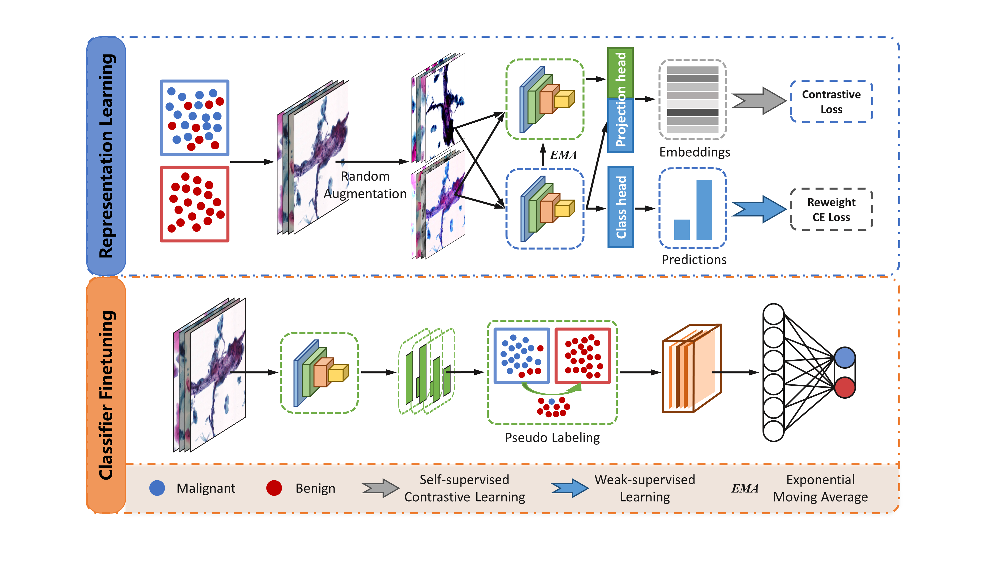

# WSCL
_**W**eak **S**upervise and **C**ontrastive **L**earning method on Cervical Malignant Classification with Inaccurate Labels._

Work flow of our work is presented below.

Our method consist two stages: 

a. **Feature Learning Stage**. We use a simple _ResNet50_ to extract features. In this stage we train the extractor in the file "train_simclr.py". 

b. **Classifier Finetuning stage**. Firstly we generate pseudo labels for _Malignant_ images based on ensemble predictions and sort their prototypes by the ensemble confidences (in "generate_pseudo.py"). Then we choose topk (128) prototypes to calibrate the generated logits for  _Malignant_ type, acquring the final prediction results (in "finetune.py").

Except for the two training files and one pseudo labeling file mentioned above, we also provide:

----data

------------augmentation.py (data augmentations for two stages)

------------gaussian_blur.py (gaussian blur augmentation for the first stage)

------------loader.py (dataloader for two stages)

----model

------------resnet_simclr.py (network architecture for feature extraction and classification based on ResNet)

----utils

------------ema.py (model exponential moving average relaization)

------------loss.py (re-weight cross-entropy loss and self-supervised contrastive loss)

------------train.py (tools for training and validating, including adjusting learning rate, record losses, reading prototypes and calculate accuracy)

----evaluation.py (for validating)

----vis_cam.py (visualize class activation maps)
      